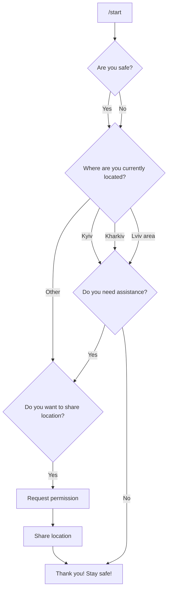

# UA staying connected Telegram bot
This is an open source project designed to help with creating a Telegram bot that help organizations stay connected with their people in Ukraine.
To use it, please fork the repo as it will require some custom code to work.

We developed this project to help us keep track of company employees in Ukraine during those hard times, and give them an easy way to report if they are safe and whether or not they need assistance.

---

## User flow



- user: `/start`

- bot: 'Are you safe?' - shows custom keyboard "Yes/No"

- bot: "Where are you currently located?" - shows custom keyboard "Kyiv" \ "Kharkiv" \ "Lviv area" \ Other"
    - If user clicks "Other" - bot: "Do you want to share location?"
        - If user clicks "Yes" - bot asks for permission to share location and sends user location after user accepts

- bot: "Do you need assistance?" - shows custom keyboard "Yes/No"
    - If user clicks "Yes" - bot: "Do you want to share location?"

- bot: "Thank you! stay safe!"
---
## Persistency
All of the responses are stored in a google sheet immidiately after the user responds (so even if the user answered some of the questions and had to stop the bot, the responses will be saved).

## Server side
In order to run the bot, you will need to run a server somewhere that is exposed to the internet so the Telegram servers can send the user's messages.
For this purpose, you can use a free service like Heroku or even serverless providers like AWS Lambda, Vercel function or Google Cloud Functions.

---

# Setup

Prerequisites:
- A Telegram account (this account will have nothing to do with the bot, it's just an account that will be used to create the bot)
- Google account with access to the Google Sheets API (see Google API setup for Google-specific instructions)
- Two pre-made spreadsheets, see example sheets and duplicate them

### Creating the bot
1. Create a telegram bot by going to https://telegram.me/botfather and typing /newbot
2. Copy the bot token and add it to an environment variable called `TELEGRAM_TOKEN`

### Google API instructions
1. Create a new project in the Google Cloud Console
2. Enable the Sheets API for this project
3. Create new Credentials: Service Account Key
4. Note the service account's email address
5. Make sure you have the two spreadsheets ready, as per the example sheets
6. Share the two spreadsheets with the service account's email (you'll be asked if it's OK to share outside your organization -- it's fine)
7. Note the two spredsheets IDs (grab them from their URL) and add them to your environment variables:

| Var name                 | Purpose                         |
|--------------------------|---------------------------------|
| SHEET_DOC_ID             | Main document with daily sheets |
| SHEET_SUBSCRIBERS_DOC_ID | Subscribers spreadsheet         |


> ⚠️&nbsp;&nbsp;If you change the internal sheet (tab) names, you will need to change them as well in `_config.js`

----
## Google Sheets API usage
```javascript
import { addOrUpdateUserResponses, COLUMN_MAPPING } from 'services/GoogleSheets';

/* Batch update a whole row */
addOrUpdateUserResponses({ 
    id: 'alpha-numeric-id',  
    name: 'Fakey McDummy', 
    answers: [
        true, 
        'Response 2', 
        false
    ] 
})
```

`id`: string; Telegram ID (or other unique identifier)

`name`: string; For display, if cannot retrieve use empty string (must not by omitted!)

`answers`: array of string | number | boolean; if a response is not available, use empty string to keep the order correct

---

```javascript
import { addOrUpdateSingleResponse } from 'services/GoogleSheets';

/* Update just one value */
addOrUpdateSingleResponse({
  id: 'alpha-numeric-id',
  column: COLUMN_MAPPING.LOCATION,
  value: 'BANG!'
});
```

`id`: string; Telegram ID (or other unique identifier)

`column`:
```javascript
`COLUMN_MAPPING.NAME` | 
`COLUMN_MAPPING.IS_SAFE` | 
`COLUMN_MAPPING.LOCATION` | 
`COLUMN_MAPPING.NEED_ASSISTANCE`
```

`value`: string | number | boolean


---
## Usage
After the bot is created and all the systems are set up, you can search for the bot in Telegram and start using it.

---

## Contributing to this project
In most cases the most useful way to use this project is to fork the repo and start working on it according to your organization's needs.
But if you spot a bug or have a suggestion that would make this project better, please send a pull request.

---

## Main Contributors
Eran Goldin - [github](https://github.com/erango) / [linkedin](https://www.linkedin.com/in/eran-goldin-4463602b/)

Gilad Solter - [github](https://github.com/gilad-solter) / [linkedin](https://www.linkedin.com/in/gilad-solter-566328102/)

Omer Herera - [github](https://github.com/OmerHerera) / [linkedin](https://www.linkedin.com/in/omer-herera-15846a6/)

---


Proudly backed by [Bizzabo](https://www.bizzabo.com)


